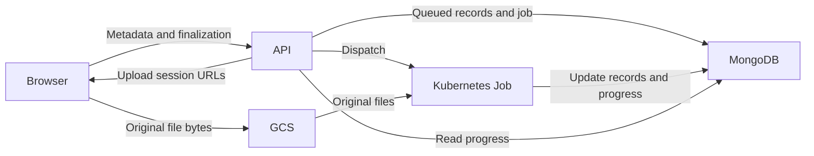

# orphaned-wells-ui-server
Backend server-side code for the orphaned wells UI

## Getting started (developer)

### Prerequisites

The following steps assume that:

1. `conda` is already installed and configured

### 1. Creating the Conda environment

Run the following command to create and activate a new Conda environment named `uow-server-env`:

```sh
conda env create --file environment.yml && conda activate uow-server-env
```

This will install the correct runtime versions of the backend (Python) and the backend dependencies.\
\
Alternatively, if you already have an environment that you would like to install the dependencies in, 
activate your environment and run the command:
```sh
pip install .
```

#### For Developers:

This section is for developers who plan to modify or contribute to the server's codebase. In the same environment
where you installed the package, run the following command:
```sh
pip install -r requirements-dev.txt
```

### 2. Add credential/environment files

Credentials are necessary for MongoDB, Google Cloud Storage uploads, and Google Document AI processing.

Create the backend environment file from the template:

```sh
cp ogrre/.env.example ogrre/.env
```

Fill in the required values described in `ogrre/.env.example`.

For Google-backed non-Docker local development, place these local service-account JSON keys in `ogrre/`, or use absolute paths in `.env`:

1. `storage-service-key.json`
    - Storage runtime service account.
    - Used only for Google Cloud Storage upload bucket reads, writes, deletes, and signed/download URL interactions.
    - `STORAGE_SERVICE_KEY` in `.env` must point to this file.
2. `document-ai-service-key.json`
    - Document AI runtime service account.
    - Used for online/batch Document AI processing and processor deployment/undeployment from the app.
    - `DOCUMENT_AI_SERVICE_KEY` in `.env` must point to this file.

Do not use the deployment/Terraform service-account key for local app runtime. That identity is for infrastructure changes and Kubernetes/App Engine deployment automation.

# Running the server

### Ensure that the `uow-server-env` Conda environment is active

```console
conda activate uow-server-env
```

### Start server on port 8001

```console
cd <orphaned-wells-ui-server-path>
uvicorn ogrre.main:app --reload --host 127.0.0.1 --port 8001
```

For Docker-based local development, place the same two runtime key files at `deployment/secrets/storage-service-key.json` and `deployment/secrets/document-ai-service-key.json`, then run the backend container:

```console
cd <orphaned-wells-ui-server-path>/deployment
docker compose --env-file ../ogrre/.env up web
```

The full Compose stack also includes nginx/certbot for deployed-hostname setups. If you run the full stack, `NGINX_ENV` in `ogrre/.env` must select an existing config directory under `deployment/nginx/`.

## Batch processing workers

Batch processing state is stored in MongoDB so it survives API restarts. Local
development defaults to `PROCESSING_JOB_MODE=background`, which runs the worker
after the API response. GKE deployments override that setting to `kubernetes`:
the API creates a short-lived, high-memory Kubernetes Job using the same built
image and runtime configuration. See `deployment/kubernetes/README.md` before
enabling the GKE path; it requires namespace RBAC for the API service account.


## Directory uploads

Google-backed directory uploads transfer original files directly from the browser
to GCS using resumable upload sessions. The API handles metadata, permission
checks, upload authorization, finalization, and job status; it never receives
file bytes on this path. A finalized directory uses the existing batch worker.



The frontend's [Uploads and processing documentation](https://catalog-historic-records.github.io/orphaned-wells-ui/docs/concepts/upload-processing)
explains directory and GCS batch workflows, progress, and recovery.

### Runtime and storage setup

- Use `STORAGE_BACKEND=google`, `STORAGE_BUCKET_NAME`, and
  `DOCUMENT_AI_BACKEND=google`. Existing storage and Document AI runtime
  credentials are reused. The browser receives only access to a specific upload
  object, never a service-account key.
- Set `ALLOWED_ORIGINS` to explicit frontend origins. Configure matching GCS CORS
  origins, `PUT`/`POST` methods, and expose `Range` for resumable uploads. The
  Terraform bucket configuration manages this; see
  [deployment/kubernetes/README.md](deployment/kubernetes/README.md).
- `DIRECTORY_UPLOAD_MAX_BYTES` defaults to 21474836480 (20 GiB). The manifest is
  limited to 1,000 files and 2 MiB of JSON. Each original file must also fit the
  installed Document AI Toolbox batch file-size limit.
- Sessions last seven days. Terraform expires objects under `directory_uploads/`
  and `directory_upload_outputs/` after 14 days. Keep this retention longer than
  the session window plus the configured worker deadline. Record images under
  `uploads/` and caller-owned GCS source files are outside these cleanup rules.
- With `PROCESSING_JOB_MODE=background`, local storage/custom Document AI uses
  the legacy directory upload path, one request at a time. Google-backed local
  development still transfers to GCS, then runs processing in the API process.
  Only Kubernetes mode isolates processing resources from the API pod.

### API contract

All endpoints require authentication and record-group access. Upload mutations
also require `upload_document`; sessions belong to their original uploader.

| Endpoint | Purpose |
| --- | --- |
| `GET /directory_uploads/{rg_id}/config` | Direct/legacy/unavailable mode and upload limits. |
| `POST /directory_uploads/{rg_id}/sessions` | Create or recover a session from `session_id`, `files`, `prevent_duplicates`, and `run_cleaning_functions`. |
| `POST /directory_uploads/{rg_id}/sessions/{id}/files/{file_id}` | Return a GCS resumable session URL or confirm that the file already exists. Requires an allowed browser `Origin`. |
| `POST /directory_uploads/{rg_id}/sessions/{id}/finalize` | Verify all objects and create/return the same durable processing job. |
| `GET /processing_jobs/{rg_id}` | Ten most recent jobs, excluding their full file manifests. |
| `GET /batch_process_documents/{job_id}/status` | Detailed status; preserves the existing endpoint. |
| `POST /processing_jobs/{rg_id}/{job_id}/retry` | Retry a failed directory job during its session window. |

A session ID is a client-generated UUID represented by 32 lowercase hexadecimal
characters. Each file has `name`, `relative_path`, and integer `size` in bytes.
The server derives MIME types and storage paths. File bytes, arbitrary buckets,
and caller-supplied object paths are not accepted in the directory manifest.

Upload grants use `if_generation_match=0` to prevent overwrites. Finalization
checks sizes and content types and records object generations; workers validate
these before processing and use generation preconditions when downloading.
Upload session URLs are bearer credentials: do not log, persist in browser
storage, or include them in support reports.

### Jobs and recovery

The frontend's **Admin → Upload history** tab separates active jobs from
finished uploads across accessible projects in the user's current team. Project
and record-group selectors narrow both lists, and each job names its project and
record group. The upload dialog displays only its current submission.
History covers worker-backed directory uploads and GCS batches; single-file/ZIP
and local-storage fallback uploads do not have durable submission tracking.

- `GET /processing_jobs/scopes` returns the user's accessible projects and record
  groups (IDs and names) for the history selectors.
- `POST /processing_jobs/history` accepts optional `project_id` and
  `record_group_id` strings, plus `page`, `active_page`,
  `page_size` (1–100, default 25), and `filter`. Active and finished pages are
  independent. Finished-job filters allow `status`, `source_type` (`directory`
  or `gcs`), `request_user.email`, and `created_at`; arbitrary Mongo operators
  and client group-scope overrides are rejected. Omitted scope selects all
  accessible groups; inaccessible scopes and project/group mismatches return
  403. Pagination and sorting apply across the whole authorized selection, and
  summaries include `project_id`, `project_name`, and `record_group_name`.
- `POST /processing_jobs/{rg_id}/history` remains available for older clients
  with the same pagination and finished-job filter contract.
- `GET /processing_jobs/{rg_id}/{job_id}` returns a compact job summary,
  retry eligibility/reason, and one file page. Query parameters are `page`,
  `page_size` (1–100), and `file_kind` (`records`, `source`, `failed`, `skipped`).
  Manifests/failure arrays are sliced in MongoDB and excluded from summary
  lists; records are paginated and linked only within the authorized group/job.
- All history reads enforce current project/record-group access; Admin placement
  adds no user-management permission requirement. Retry still requires upload permission,
  ownership of the session, unexpired inputs, and confirmation that the previous
  worker has stopped. Eligibility shown by the UI is checked again on retry.

Workers report `stage` and `last_progress_at` when preparing files, waiting for
Document AI, saving results, and completing batches. These are activity events,
not heartbeats; parallel batches can alternate the latest reported stage.
Older jobs without these fields show no recorded activity. This change adds no
automatic retention or forced recovery and requires no Terraform changes.
Deploy the API and worker image together to populate the new activity fields.

Directory finalization creates metadata-only records with `status=queued` after
verifying every uploaded original. Record numbers and IDs exist before a worker
starts; conversion and image bytes remain in the worker. Duplicate decisions
are persisted before record creation, and initialization can resume after an
interrupted finalization without duplicating records. The worker changes each
record to `processing` as it prepares its images, then `digitized` or `error`.
Download/conversion failures are attached to the pending record as well as the job.

The record-group table refreshes quietly while jobs are active, including jobs
outside the displayed page or filters, and performs a final fetch at completion.
Polling also runs while the upload dialog is open so newly finalized records
appear without a page reload. Filters, pagination, and existing rows are preserved.
`POST /get_records/record_group` returns `has_active_processing_jobs` after
checking record-group access; the flag is independent of the table's filters.

Kubernetes processing capacity is reserved atomically in MongoDB. Additional
jobs remain `queued`; the API's 30-second maintenance loop dispatches queued
jobs and reconciles worker failures independently of browser polling. All API
replicas may run maintenance; deterministic Kubernetes names and atomic job
claims make repeated dispatch safe. Local background mode bypasses this capacity
queue and has no restart recovery guarantee.

Local background workers reuse the API's initialized data manager/Mongo client.
Creating a new Mongo client for each local job previously required fresh SRV DNS
resolution, which could fail after a VPN/network change even while the API's
existing connection continued to work. Worker exceptions, including failures
before the job is claimed, are now recorded as job errors. If MongoDB is
temporarily unavailable for the error write, maintenance retries that write every
30 seconds while this API process stays alive; it does not rerun processing.

For an older local job left `dispatched` by a confirmed worker-startup exception,
first restore database/DNS connectivity and confirm the original worker has
stopped before manually running the same job from the backend repository:

```sh
python -m ogrre.processing_worker --job-id <job-id> --attempt <attempt-number>
```

The CLI loads the usual local dotenv configuration before its runtime imports.
Use the job's current attempt (zero for an initial submission). This command
claims an already-dispatched job; failed jobs should use **Retry failed
processing** instead. Do not reset a running job based only on elapsed time:
check recorded Document AI operations and worker state before recovery.

Directory finalization is idempotent, including after an uncertain HTTP response.
A retry gets a new Kubernetes Job name and attempt number while retaining the
logical job ID. Records have stable IDs derived from job and source identity.
Successful records are skipped on retry; failed records are reused. Recorded,
unconsumed Document AI operations are reattached after an interruption.

There is an unavoidable uncertain boundary if the worker dies after Document AI
accepts a submission but before MongoDB stores its operation name. Inspect the
cloud operation before retrying in that case; this is not an exactly-once
external submission guarantee. Automatic Kubernetes retries stay disabled.
GCS-source batches retain their existing manual recovery workflow.

Single-file/ZIP uploads, record-image uploads, imports, rotation, and exports
still execute work in API pods. Keep existing API requests until representative
staging measurements show that lower CPU/memory is safe. Per-environment API
and worker sizing remain independent.

### Validation

Install `requirements-dev.txt`, then run:

```sh
python -m pytest ogrre/tests -q
python -m py_compile ogrre/main.py ogrre/routers/router.py ogrre/processing_worker.py ogrre/internal/directory_upload.py ogrre/internal/data_manager.py ogrre/internal/storage_api.py ogrre/internal/batch_document_processing.py ogrre/internal/processing_job_runner.py ogrre/internal/document_ai_api.py
```

Upload tests use an isolated MongoDB test double and mocked cloud calls. They do
not prove live GCS CORS, IAM, Kubernetes scheduling, Document AI compatibility,
or production memory usage; use the deployment smoke checks before rollout.

The GitHub Actions **Checks** workflow runs Black and **Backend tests (pytest)**
in separate, parallel jobs. Pytest uses Python 3.12 and the development
requirements, with pip downloads cached between runs; it needs no MongoDB
service or cloud credentials. Frontend E2E testing starts only after both jobs
pass, so backend failures are reported before starting the Docker/browser suite.
