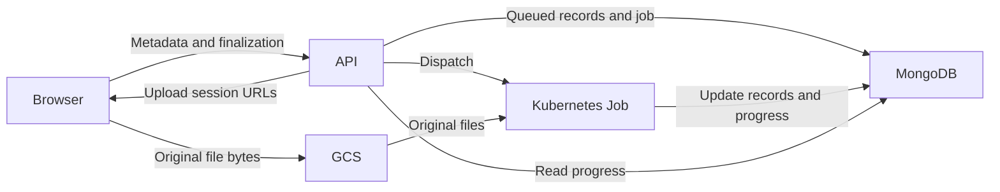

# orphaned-wells-ui-server
Backend server-side code for the orphaned wells UI

## Getting started (developer)

### Prerequisites

The following steps assume that:

1. `conda` is already installed and configured

### 1. Creating the Conda environment

Run the following command to create and activate a new Conda environment named `uow-server-env`:

```sh
conda env create --file environment.yml && conda activate uow-server-env
```

This will install the correct runtime versions of the backend (Python) and the backend dependencies.\
\
Alternatively, if you already have an environment that you would like to install the dependencies in, 
activate your environment and run the command:
```sh
pip install .
```

#### For Developers:

This section is for developers who plan to modify or contribute to the server's codebase. In the same environment
where you installed the package, run the following command:
```sh
pip install -r requirements-dev.txt
```

### 2. Add credential/environment files

Credentials are necessary for MongoDB, Google Cloud Storage uploads, and Google Document AI processing.

Create the backend environment file from the template:

```sh
cp ogrre/.env.example ogrre/.env
```

Fill in the required values described in `ogrre/.env.example`.

For Google-backed non-Docker local development, place these local service-account JSON keys in `ogrre/`, or use absolute paths in `.env`:

1. `storage-service-key.json`
    - Storage runtime service account.
    - Used only for Google Cloud Storage upload bucket reads, writes, deletes, and signed/download URL interactions.
    - `STORAGE_SERVICE_KEY` in `.env` must point to this file.
2. `document-ai-service-key.json`
    - Document AI runtime service account.
    - Used for online/batch Document AI processing and processor deployment/undeployment from the app.
    - `DOCUMENT_AI_SERVICE_KEY` in `.env` must point to this file.

Do not use the deployment/Terraform service-account key for local app runtime. That identity is for infrastructure changes and Kubernetes/App Engine deployment automation.

# Running the server

### Ensure that the `uow-server-env` Conda environment is active

```console
conda activate uow-server-env
```

### Start server on port 8001

```console
cd <orphaned-wells-ui-server-path>
uvicorn ogrre.main:app --reload --host 127.0.0.1 --port 8001
```

For Docker-based local development, place the same two runtime key files at `deployment/secrets/storage-service-key.json` and `deployment/secrets/document-ai-service-key.json`, then run the backend container:

```console
cd <orphaned-wells-ui-server-path>/deployment
docker compose --env-file ../ogrre/.env up web
```

The full Compose stack also includes nginx/certbot for deployed-hostname setups. If you run the full stack, `NGINX_ENV` in `ogrre/.env` must select an existing config directory under `deployment/nginx/`.

## Schema management

`USE_DB_PROCESSORS=false` uses the installed `ogrre_data_cleaning` package and
shows its schemas read-only. `USE_DB_PROCESSORS=true` enables Mongo schema
management. The setting defaults to `false` when omitted; enable database mode
explicitly when the deployment should use the Mongo catalog. The Mongo catalog
is shared by all teams in the database.

Existing projects, record groups, and records remain accessible when their
schema cannot be resolved. Missing package processors (including after changing
collaborators), missing or ambiguous Mongo bindings, and unmigrated embedded
schemas are treated as having no schema when reading or editing record data.
Stored bindings and attribute values are preserved; column discovery and exports
use the existing active attributes. Schema selection, schema generation, cleaning,
and document processing still require the appropriate valid schema or processor.
Run the binding migration to enable legacy Mongo schemas, not to restore access
to the records themselves.

- `manage_schema` permits viewing schemas, editing cleaning functions, aliases,
  data types, database data types, order and display metadata, adding fields,
  and uploading new schemas. Type combinations and parent/child structure are
  validated before saving.
- `manage_schema_destructive` additionally permits field removal,
  schema replacement/deletion, and changing existing processor/model bindings.
  It can only be assigned to the `sys_admin` system role. Auth-disabled and
  anonymous access cannot authorize these actions.
- Field renaming is disabled for every role. Schema changes through record
  imports and record-group updates enforce the same permissions. Existing
  group schemas cannot be silently replaced by an ordinary record import.
- Removed schemas are archived in `deleted_processors`. Removed schema fields
  and their record attributes are retained with `deleted: true`.

### Retired record fields

Retiring a schema field preserves its record values, raw text, coordinates,
confidence, and nested children. Retired fields are hidden from the record UI,
cleaning, filters, sorting, counts, statistics, column discovery, and CSV/JSON
exports. The record-detail API retains the complete attribute tree for future
tools; clients must preserve its original indexes. No restore or deleted-field
view is provided. Re-adding a schema field does not restore its old values.

In Mongo mode, fields absent from the schema stay visible; only explicit field
retirement or removal during schema replacement retires them. In repo mode,
unmatched fields are marked deleted. A missing processor definition never means
"delete every field." Existing `data_fusion` settings are ignored.

Project lists, record-group statistics, record tables, navigation, and column
discovery read stored data without reconciling records or resolving every group's
schema. Statistics use a read-only Mongo aggregation, ignore malformed attribute
entries/containers, and inspect active attributes up to 12 levels deep. They do
not depend on an existing `has_errors` cache. Invalid attributes do not prevent
records from contributing to total/reviewed counts.

For metadata filters and sorts (including All Records ordered by `dateCreated`),
the query keeps filtering, indexed sorting, ranking, and pagination ahead of
retired-field hiding. The paged result query prunes its returned records. This
allows the existing `dateCreated` index to supply the order without a blocking
sort over every record's attributes. Attribute-based filters/sorts and unknown
query expressions retain pruning before evaluation so retired values cannot
affect their results. The fix requires no index migration or disk-sort setting.

Opening a record prepares only that record, synchronously, before returning its
edit indexes and revision. Malformed entries and containers are ignored during
preparation; valid values and retired contents are preserved. Record creation
and attribute edits apply the current schema when saving.
New records never receive placeholders for retired schema fields. If an import
actually supplies a value for one of those fields, that supplied value is kept
as retired; absent fields are not added.

Safe alias/order/cleaning-function edits do not scan records. Explicit field
retirement, schema replacement, group reassignment/detachment, and cleaning
perform their required reconciliation as part of the requested mutation. Schema
operations run outside the API event loop and return success only when finished;
large operations can take time, but ordinary page requests do not wait for them.
Package import progress includes applying the final definitions to affected
groups, and an interrupted import can be resumed. Conditional record writes
preserve concurrent edits. Reintroducing a field first applies old retirement
so its stored values are never silently restored.

After deploying a new repo package, or for retirement definitions left unapplied
by an older release, operators can apply a schema explicitly in bounded batches:

```sh
python -m ogrre.reconcile_schema_records RECORD_GROUP_ID
python -m ogrre.reconcile_schema_records RECORD_GROUP_ID --batch-size 100 --apply
```

The command uses the configured database and collaborator, displays the target
without credentials, and asks for confirmation before applying each batch (1–1,000
records). Repeat until `complete` is true and `remaining` is zero. A preview
does not rewrite records. Until maintenance completes, lists use the retirement
flags already stored; opening an individual record applies its current schema.
This command is optional maintenance, not a prerequisite for loading pages.
No record reconciliation runs at startup. Startup creates the compound
`record_group_id`/`attribute_schema_revision` index used by maintenance.

Deploy the paired frontend and backend updates together and refresh open record
pages. Attribute edits, inserts, manual deletes, coordinate edits, and review
resets must send the `attribute_revision` returned by the record-detail API.
Successful edits return the new revision. A missing or stale revision returns
409; reload the record before retrying. Never persist a filtered list as the
complete record tree. Manual deletion of an active `user_added` field retains
its existing behavior. Previously discarded data cannot be recovered by this
change.

### Schema identity and processor settings

Mongo schemas keep their identity in the existing `processors` collection.
APIs expose the document ID as `schema_id`; record groups store that ID instead
of using a processor ID as their schema identity. Multiple schemas may share
processor/model identifiers. Schema names remain immutable; metadata updates,
field edits, and file replacement accept `schema_id` and preserve the document
ID and connected groups. Legacy name-based management calls remain supported
when the name is unambiguous.

`POST /create_schema` creates a schema, including an empty one, with
`manage_schema`. It requires `name` and `documentType`; `attributes`, display
metadata, `processorId`, and `modelId` are optional. New schemas record
`created_by`, `created_by_team`, `created_at`, and `updated_at`. This metadata
does not limit access to the shared catalog. Existing unknown creators are not
backfilled with the migration operator's identity.

Processor-free schemas support imported records, field ordering, and cleaning.
Extraction requires both a processor ID and model ID. `parser_type` optionally
selects `custom` or `form_parser`; when absent, pretrained form-parser model IDs
select form parsing and other models use custom extraction. The selected
configuration controls parsing for each request. Batch jobs snapshot it when
queued so catalog changes do not alter retries of an existing job.

The group API returns `schema_source`, `schema_name`, `active_schema_id`,
`has_schema`, `can_process`, and any `schema_error` for UI availability. An
administrator changes the Mongo binding through `schema_id` on the existing
group-update route; `schema_id: null` explicitly detaches the group, preserves
records, and suppresses legacy fallback in Mongo mode. In-use schemas must be
detached before deletion. Field changes belong on the shared schema, and generic
record-group updates no longer accept embedded schema edits.

In repo mode, schema resolution uses only the installed package and the group's
repo processor ID. Mongo references and old embedded fields are inactive.
Missing or ambiguous configurations fail explicitly; an unknown processor ID
is never paired with the default model. The built-in repo default remains
available only when explicitly selected. Empty Mongo catalogs have no fallback.

New JSON/CSV groups remain schema-less unless their import package explicitly
includes schema metadata. In Mongo mode, explicit imported metadata creates a
shared catalog schema and attaches it. Appending records cannot replace schema
fields. Existing group-local schemas require migration before use in Mongo mode.

### Migrate legacy Mongo schema bindings

Deploy the frontend, API, and processing worker updates together. Pause record
and schema edits during migration and back up the target catalog, groups, and
history. With `USE_DB_PROCESSORS=true` and the intended database configured,
preview without writing:

```sh
python -m ogrre.migrate_schema_bindings
```

Use `--env=.env.isgs` to select a dotenv file explicitly (relative to the
current directory). Its values override existing environment variables; without
the flag, normal `.env` discovery is unchanged. The command prints the Mongo
hosts without credentials, the database name, and the configured collaborator.
The scope is all record groups in that database; collaborator is informational.

The preview reports unique processor-ID matches, embedded schemas to create,
schema-less groups, and conflicts. Missing or duplicate processor matches,
divergent embedded fields, and invalid existing references require an explicit
choice. Creator metadata for converted embedded schemas comes from the group
only when known. Old processor IDs remain available for repo-mode operation.

Apply unambiguous changes with `--apply`. It always displays the preview first
and requires `y` at the confirmation prompt before writing. Any other answer,
EOF, or Ctrl+C cancels. If groups or schemas change while you review the preview,
the apply stops and requires a fresh preview. For example:

```sh
python -m ogrre.migrate_schema_bindings --env=.env.isgs --apply
```

To resolve conflicts, pass
`--resolutions path/to/resolutions.json` to preview, then to apply. The JSON
maps record-group IDs to an existing schema ID, `"embedded"` to preserve their
embedded definition as a catalog entry, or `null` to detach them:

```json
{
  "aaaaaaaaaaaaaaaaaaaaaaaa": "bbbbbbbbbbbbbbbbbbbbbbbb",
  "cccccccccccccccccccccccc": "embedded",
  "dddddddddddddddddddddddd": null
}
```

The command is idempotent, creates deterministic IDs for converted schemas,
checks original group bindings before writing, and records before-state history.
It leaves unresolved groups untouched and exits nonzero when conflicts remain;
other valid changes may already have been applied. Preview and retry after
resolving conflicts. It does not modify records or recover previously discarded
data. Startup never runs this migration. Until migration, only unambiguous
legacy processor-ID lookup is supported; migrate those references before changing
their processor IDs. Startup adds a `schema_id` index to record groups.

### Import installed package schemas into Mongo

In DB mode, the Schema page offers **Import repo schemas**. The workflow reads
only the installed `ogrre_data_cleaning` package for the user's active
collaborator and displays its installed version. It does not synchronize schemas
or fetch GitHub. Missing files, duplicate package names, and invalid definitions
are reported instead of silently importing incomplete definitions.

- `GET /get_repo_schema_import`: available definitions, source/version, and any
  unfinished import.
- `POST /preview_repo_schema_import`: `{mode: "add" | "replace", selected:
  [source_id], decisions: {source_id: {action: "keep" | "replace", schema_id}}}`.
  Returns field/metadata differences, conflict candidates, and affected groups
  across all teams. A preview does not change catalog entries, groups, or records.
- `POST /apply_repo_schema_import`: `{import_id}` applies the saved preview.
  Definitions, operations, and scope cannot be supplied in the apply request.

`manage_schema` permits Add and keeping conflicts. Replacing a definition or the
catalog requires `manage_schema_destructive`, as does activating a previously
missing legacy group binding. Permissions are checked again on apply; an
administrator can resume another user's unfinished import. Imported definitions
retain package/collaborator/source identity for future matching, but remain
ordinary editable Mongo schemas. Names and IDs of matched schemas stay stable.
New entries record their creating user/team; existing unknown creators are not
invented. There is no team filter on the catalog or impact preview.

Replace archives removed schemas in `deleted_processors` and explicitly detaches
their groups first. Existing retirement state is reconciled before bindings or
schemas change; replacement differences preserve retired definitions and values.
Unknown imported fields stay visible. Ambiguous legacy bindings or divergent
embedded schemas must be resolved before an affected import can apply.

The provided local Mongo deployment is standalone, so this workflow uses ordered,
resumable operations instead of requiring replica-set transactions. Deploy all
API instances together: schema CRUD and group configuration writes participate in
a shared Mongo guard. Do not run binding migrations, old API versions, or manual
catalog/binding writes concurrently with an import. Reads and ordinary record
work remain available; partial application is visible until resumption finishes.

`schema_imports` stores the approved operations, before states, source/version,
actor/team, decisions, and progress. Repeating apply on the same import ID resumes
its remaining steps or returns the completed receipt. Previews expire after
30 minutes; changed catalog/group/source snapshots require a new preview before
the first write. Interrupted imports retain the approved snapshot and do not
expire. Each completed step has an idempotent history entry. Preview size is
limited to 12 MiB and source catalogs to 250 schemas. Saved import journals have
no automatic TTL because their before states and decisions are audit records.

Handled failures return `status: "partial"` with progress and an error; the UI
keeps retry available. `schema_catalog_guard.pending_import` prevents other
catalog/group-configuration changes until that import completes. Reopen the
dialog and select **Review saved import**, then **Resume import**.

The guard deliberately has no automatic owner expiry: a slow writer must never
lose exclusivity mid-write. If an API process is killed while holding the guard,
stop all API/worker writers and confirm the process is no longer running before
operator recovery. In the intended database, inspect
`db.schema_catalog_guard.findOne({_id: "catalog"})`, retain the reported owner,
then clear only that owner using a conditional update:

```javascript
db.schema_catalog_guard.updateOne(
  {_id: "catalog", owner: "<observed-owner>"},
  {$set: {owner: null}}
)
```

Keep `pending_import` and the journal intact. Restart the updated API/worker
versions and resume through the dialog. Do not clear the guard while a writer may
still be executing. Finish pending imports before switching schema source modes.

### Generate schemas from stored records

In database schema mode, users with `manage_schema` and access to a record group
can choose **Generate schema** once it contains records and has no attached schema.
The preview proposes fields from stored attributes; it does not reread uploaded
files or change values. Review and edit suggestions, then confirm **Create and
attach schema**. The result is a normal shared catalog entry with creator/team
and sampling provenance, initially without a processor. Administrators can add
processor/model identifiers later in the schema editor.

For a group with a schema, **Add fields to schema** offers the same preview for
new paths only. Existing definitions and retired paths are preserved. The additions
affect every group using that shared schema. Neither action runs during upload.

`POST /record_groups/{id}/schema/preview` accepts `mode` (`generate` or `extend`)
and an optional lower `record_limit`. `POST /record_groups/{id}/schema/apply`
accepts the returned `preview_id`, edited `fields`, and, for generation, `name`
and `documentType`. Mode, permission, group access, preview ownership, schema
state, and the sampled records are checked before applying. Preview expiry is
30 minutes. Preview field names cannot be changed; existing types are edited
through the regular schema editor instead of the additive workflow.

Sampling uses the `(record_group_id, _id)` index created at backend startup and
reads in ascending ID order. `SCHEMA_INFERENCE_MAX_RECORDS` defaults to 1,000
(configurable from 1 to 10,000). Fixed limits also apply: 256 KiB per stored
record, 8 MiB per sample, 500 discovered paths, 12 nesting levels, 100,000
attribute instances, a five-second Mongo query limit, and 1 MiB request/schema
payloads. Oversized records are skipped before their attributes are transferred.
The preview reports partial coverage and uncertain types. Numeric-looking text
can receive numeric suggestions; leading-zero identifiers and date-like text
stay text. Empty-only and mixed-type fields receive conservative suggestions.
Original blank CSV columns absent from stored attributes cannot be recovered.

Saved previews and apply plans live in `schema_generations`. Apply uses the same
catalog guard as other schema mutations and saves its exact plan before writing
the schema and group binding. Retry the same request after a lost response or
interrupted save; IDs and history entries are reused. A later schema/group change
causes a conflict instead of overwriting it. If a partial generation saved a
schema before its group changed, the schema remains available in the shared
catalog. No record attributes are rewritten by generation or extension. The
existing catalog-lock crash recovery instructions also apply here.

### Migrate existing role assignments

Use the backend environment configured for the intended database. Review and
back up its current role assignments before applying changes. This command
previews changes without writing:

```sh
python -m ogrre.migrate_schema_permissions
```

To select a different dotenv file, use `--env` on both preview and apply:

```sh
python -m ogrre.migrate_schema_permissions --env=.env.isgs
python -m ogrre.migrate_schema_permissions --env=.env.isgs --apply
```

Relative paths are resolved from your current directory; for files inside the
backend package, use `--env=ogrre/.env.isgs`. The selected file's values override
matching process environment variables, and the command prints its resolved path.
A missing, unreadable, or empty file stops the command before connecting.
Without `--env`, automatic `.env` discovery and existing environment precedence
are unchanged.

Every run displays the configured MongoDB hosts, database name, and collaborator
before the proposed role changes. Credentials and URI query options are omitted.
The collaborator is informational: the migration covers all roles in the selected
database, and `DB_NAME` selects the database even when the URI includes another name.

To apply, run:

```sh
python -m ogrre.migrate_schema_permissions --apply
```

This shows the target and preview again, then waits for `y` at the `[y/N]` prompt.
Any other answer, end of input, or Ctrl+C cancels without writing. If the preview
changes while awaiting confirmation, the migration stops and requires a new
preview. When no changes are needed, it exits without prompting.

The migration grants `manage_schema` to `team_lead` and all system roles, grants
`manage_schema_destructive` only to `sys_admin`, and removes that permission
from other roles. Other permissions are preserved. It is idempotent, records
applied changes in history, and rejects concurrent role changes; preview and
retry after resolving a conflict. Have users refresh their permission state
after rollout. Neither API startup nor changing schema mode runs the migration.

For cloud development and production, run the three commands below separately
in each database's configured backend environment (the deployed backend container
or a local backend environment configured for that database). Confirm `DB_NAME`
and the intended cluster in your configuration first. `DB_CONNECTION`, `DB_NAME`,
and, for the separate-credentials configuration, `DB_USERNAME`/`DB_PASSWORD`
select the target. Existing process environment variables take precedence over
the automatically discovered dotenv file; an explicit `--env` file overrides
matching variables. Do not paste credentials into shell history.

```sh
python -m ogrre.migrate_schema_permissions
python -m ogrre.migrate_schema_permissions --apply
python -m ogrre.migrate_schema_permissions
```

The first command previews; run the second after reviewing it and backing up
the role documents, then confirm with `y`. The last should report `No changes
needed.` with an empty changes list. Apply to
development first, verify a team lead's safe edits and a signed-in administrator's
destructive actions, then repeat for each production collaborator database.
This updates role definitions, not users' assigned roles, schemas, or records.
Users should refresh or sign in again so their frontend permission state reloads.

The frontend repository's Docker sample dump and downloadable
`InitializeMongoDB.py` already include these permissions. Fresh databases created
with either need no schema-permission migration. Existing Docker volumes and
cloud databases still need the migration; restarting containers does not update
stored roles. See `../orphaned-wells-ui/deployment/README.md` for the interactive
Docker command. Starting Docker or the API never migrates a cloud database.

### Schema edit performance

Safe field saves (aliases, order, cleaning functions, and type metadata) update
the shared schema without scanning record groups or rewriting records. Opening
a record applies its current display settings to that record only. Retirement,
replacement, and reintroduction explicitly reconcile affected records as part of
the mutation; large changes can require substantial work. Project and table
requests never trigger that work, including the first read after deployment.
The catalog guard uses one atomic acquisition and one release per outer mutation.
It rejects busy/unfinished imports instead of waiting for their lock. Permission
checks read the stored user and resolve its roles once, without fetching the
enriched user response.

### Schema API contract

Deploy the frontend and backend changes together. `GET /get_schema` now returns
`{ "processors": [...], "source": "repo" | "database", "read_only": boolean }`
instead of a bare array. Mongo mutations return 409 in repo mode. Malformed
schema mutations return 400, denied permissions 403, missing schemas/fields
404, and duplicate identifiers or concurrent updates 409.

CSV/JSON schema uploads normalize field types and numeric order, retain
supported metadata, and validate unique paths, parent/child structure and
cleaning functions. Ambiguous legacy processor identifiers must be resolved
before editing or using them; the API no longer selects an arbitrary match.

## Batch processing workers

Batch processing state is stored in MongoDB so it survives API restarts. Local
development defaults to `PROCESSING_JOB_MODE=background`, which runs the worker
after the API response. GKE deployments override that setting to `kubernetes`:
the API creates a short-lived, high-memory Kubernetes Job using the same built
image and runtime configuration. See `deployment/kubernetes/README.md` before
enabling the GKE path; it requires namespace RBAC for the API service account.


## Directory uploads

Google-backed directory uploads transfer original files directly from the browser
to GCS using resumable upload sessions. The API handles metadata, permission
checks, upload authorization, finalization, and job status; it never receives
file bytes on this path. A finalized directory uses the existing batch worker.



The frontend's [Uploads and processing documentation](https://catalog-historic-records.github.io/orphaned-wells-ui/docs/concepts/upload-processing)
explains directory and GCS batch workflows, progress, and recovery.

### Runtime and storage setup

- Use `STORAGE_BACKEND=google`, `STORAGE_BUCKET_NAME`, and
  `DOCUMENT_AI_BACKEND=google`. Existing storage and Document AI runtime
  credentials are reused. The browser receives only access to a specific upload
  object, never a service-account key.
- Set `ALLOWED_ORIGINS` to explicit frontend origins. Configure matching GCS CORS
  origins, `PUT`/`POST` methods, and expose `Range` for resumable uploads. The
  Terraform bucket configuration manages this; see
  [deployment/kubernetes/README.md](deployment/kubernetes/README.md).
- `DIRECTORY_UPLOAD_MAX_BYTES` defaults to 21474836480 (20 GiB). The manifest is
  limited to 1,000 files and 2 MiB of JSON. Each original file must also fit the
  installed Document AI Toolbox batch file-size limit.
- Sessions last seven days. Terraform expires objects under `directory_uploads/`
  and `directory_upload_outputs/` after 14 days. Keep this retention longer than
  the session window plus the configured worker deadline. Record images under
  `uploads/` and caller-owned GCS source files are outside these cleanup rules.
- With `PROCESSING_JOB_MODE=background`, local storage/custom Document AI uses
  the legacy directory upload path, one request at a time. Google-backed local
  development still transfers to GCS, then runs processing in the API process.
  Only Kubernetes mode isolates processing resources from the API pod.

### API contract

All endpoints require authentication and record-group access. Upload mutations
also require `upload_document`; sessions belong to their original uploader.

| Endpoint | Purpose |
| --- | --- |
| `GET /directory_uploads/{rg_id}/config` | Direct/legacy/unavailable mode and upload limits. |
| `POST /directory_uploads/{rg_id}/sessions` | Create or recover a session from `session_id`, `files`, `prevent_duplicates`, and `run_cleaning_functions`. |
| `POST /directory_uploads/{rg_id}/sessions/{id}/files/{file_id}` | Return a GCS resumable session URL or confirm that the file already exists. Requires an allowed browser `Origin`. |
| `POST /directory_uploads/{rg_id}/sessions/{id}/finalize` | Verify all objects and create/return the same durable processing job. |
| `GET /processing_jobs/{rg_id}` | Ten most recent jobs, excluding their full file manifests. |
| `GET /batch_process_documents/{job_id}/status` | Detailed status; preserves the existing endpoint. |
| `POST /processing_jobs/{rg_id}/{job_id}/retry` | Retry a failed directory job during its session window. |

A session ID is a client-generated UUID represented by 32 lowercase hexadecimal
characters. Each file has `name`, `relative_path`, and integer `size` in bytes.
The server derives MIME types and storage paths. File bytes, arbitrary buckets,
and caller-supplied object paths are not accepted in the directory manifest.

Upload grants use `if_generation_match=0` to prevent overwrites. Finalization
checks sizes and content types and records object generations; workers validate
these before processing and use generation preconditions when downloading.
Upload session URLs are bearer credentials: do not log, persist in browser
storage, or include them in support reports.

### Jobs and recovery

The frontend's **Admin → Upload history** tab separates active jobs from
finished uploads across accessible projects in the user's current team. Project
and record-group selectors narrow both lists, and each job names its project and
record group. The upload dialog displays only its current submission.
History covers worker-backed directory uploads and GCS batches; single-file/ZIP
and local-storage fallback uploads do not have durable submission tracking.

- `GET /processing_jobs/scopes` returns the user's accessible projects and record
  groups (IDs and names) for the history selectors.
- `POST /processing_jobs/history` accepts optional `project_id` and
  `record_group_id` strings, plus `page`, `active_page`,
  `page_size` (1–100, default 25), and `filter`. Active and finished pages are
  independent. Finished-job filters allow `status`, `source_type` (`directory`
  or `gcs`), `request_user.email`, and `created_at`; arbitrary Mongo operators
  and client group-scope overrides are rejected. Omitted scope selects all
  accessible groups; inaccessible scopes and project/group mismatches return
  403. Pagination and sorting apply across the whole authorized selection, and
  summaries include `project_id`, `project_name`, and `record_group_name`.
- `POST /processing_jobs/{rg_id}/history` remains available for older clients
  with the same pagination and finished-job filter contract.
- `GET /processing_jobs/{rg_id}/{job_id}` returns a compact job summary,
  retry eligibility/reason, and one file page. Query parameters are `page`,
  `page_size` (1–100), and `file_kind` (`records`, `source`, `failed`, `skipped`).
  Manifests/failure arrays are sliced in MongoDB and excluded from summary
  lists; records are paginated and linked only within the authorized group/job.
- All history reads enforce current project/record-group access; Admin placement
  adds no user-management permission requirement. Retry still requires upload permission,
  ownership of the session, unexpired inputs, and confirmation that the previous
  worker has stopped. Eligibility shown by the UI is checked again on retry.

Workers report `stage` and `last_progress_at` when preparing files, waiting for
Document AI, saving results, and completing batches. These are activity events,
not heartbeats; parallel batches can alternate the latest reported stage.
Older jobs without these fields show no recorded activity. This change adds no
automatic retention or forced recovery and requires no Terraform changes.
Deploy the API and worker image together to populate the new activity fields.

Directory finalization creates metadata-only records with `status=queued` after
verifying every uploaded original. Record numbers and IDs exist before a worker
starts; conversion and image bytes remain in the worker. Duplicate decisions
are persisted before record creation, and initialization can resume after an
interrupted finalization without duplicating records. The worker changes each
record to `processing` as it prepares its images, then `digitized` or `error`.
Download/conversion failures are attached to the pending record as well as the job.

The record-group table refreshes quietly while jobs are active, including jobs
outside the displayed page or filters, and performs a final fetch at completion.
Polling also runs while the upload dialog is open so newly finalized records
appear without a page reload. Filters, pagination, and existing rows are preserved.
`POST /get_records/record_group` returns `has_active_processing_jobs` after
checking record-group access; the flag is independent of the table's filters.

Kubernetes processing capacity is reserved atomically in MongoDB. Additional
jobs remain `queued`; the API's 30-second maintenance loop dispatches queued
jobs and reconciles worker failures independently of browser polling. All API
replicas may run maintenance; deterministic Kubernetes names and atomic job
claims make repeated dispatch safe. Local background mode bypasses this capacity
queue and has no restart recovery guarantee.

Local background workers reuse the API's initialized data manager/Mongo client.
Creating a new Mongo client for each local job previously required fresh SRV DNS
resolution, which could fail after a VPN/network change even while the API's
existing connection continued to work. Worker exceptions, including failures
before the job is claimed, are now recorded as job errors. If MongoDB is
temporarily unavailable for the error write, maintenance retries that write every
30 seconds while this API process stays alive; it does not rerun processing.

For an older local job left `dispatched` by a confirmed worker-startup exception,
first restore database/DNS connectivity and confirm the original worker has
stopped before manually running the same job from the backend repository:

```sh
python -m ogrre.processing_worker --job-id <job-id> --attempt <attempt-number>
```

The CLI loads the usual local dotenv configuration before its runtime imports.
Use the job's current attempt (zero for an initial submission). This command
claims an already-dispatched job; failed jobs should use **Retry failed
processing** instead. Do not reset a running job based only on elapsed time:
check recorded Document AI operations and worker state before recovery.

Directory finalization is idempotent, including after an uncertain HTTP response.
A retry gets a new Kubernetes Job name and attempt number while retaining the
logical job ID. Records have stable IDs derived from job and source identity.
Successful records are skipped on retry; failed records are reused. Recorded,
unconsumed Document AI operations are reattached after an interruption.

There is an unavoidable uncertain boundary if the worker dies after Document AI
accepts a submission but before MongoDB stores its operation name. Inspect the
cloud operation before retrying in that case; this is not an exactly-once
external submission guarantee. Automatic Kubernetes retries stay disabled.
GCS-source batches retain their existing manual recovery workflow.

Single-file/ZIP uploads, record-image uploads, imports, rotation, and exports
still execute work in API pods. Staging now targets 1 CPU / 4 GiB for its single
API pod with two Uvicorn workers; its processing worker retains 1 CPU / 6 GiB.
Production targets two API replicas at 1 CPU / 6 GiB each; its processing
workers retain 1850m CPU / 12 GiB. Further API reductions depend on staging
measurements establishing safe headroom.
See the [resource rollout](deployment/kubernetes/README.md#staging-checks-before-reducing-api-resources)
for validation, deployment, and rollback steps. API and worker sizing remain
independent.

### Validation

Install `requirements-dev.txt`, then run:

```sh
python -m pytest ogrre/tests -q
python -m py_compile ogrre/main.py ogrre/routers/router.py ogrre/processing_worker.py ogrre/internal/directory_upload.py ogrre/internal/data_manager.py ogrre/internal/storage_api.py ogrre/internal/batch_document_processing.py ogrre/internal/processing_job_runner.py ogrre/internal/document_ai_api.py
```

Upload tests use an isolated MongoDB test double and mocked cloud calls. They do
not prove live GCS CORS, IAM, Kubernetes scheduling, Document AI compatibility,
or production memory usage; use the deployment smoke checks before rollout.

The GitHub Actions **Checks** workflow runs Black and **Backend tests (pytest)**
in separate, parallel jobs. Pytest uses Python 3.12 and the development
requirements, with pip downloads cached between runs; it needs no MongoDB
credentials or cloud credentials. The test job starts an isolated MongoDB 7
service and sets its blocking-sort limit to 32 MiB. Query regressions verify
index use, pagination/navigation, and retired-field filtering with disk spilling
disabled. Loading integration tests exercise projects, record groups, records,
columns, and schemas with `USE_DB_PROCESSORS` both disabled and enabled. Frontend
E2E testing starts only after both jobs pass, so backend failures are reported
before starting the Docker/browser suite.

To include these integration tests locally, set `OGRRE_TEST_MONGO_URI` to a
disposable local MongoDB (for example `mongodb://127.0.0.1:27029`) before running
pytest. The tests require localhost, create uniquely named test databases, and
remove those databases afterward. Without that variable, Mongo integration tests
are skipped. Do not point tests at staging or production.

For push and pull-request runs, E2E tests pair the triggering backend commit with
`main` in `CATALOG-Historic-Records/orphaned-wells-ui`. For coordinated changes,
select **Actions → Checks → Run workflow**, choose the backend branch in the
branch selector, and set `frontend_ref` to the frontend branch, tag, or commit.
Optionally set `frontend_repository` to a fork (`owner/repository`). Defaults
remain the upstream frontend's `main`; overrides affect only that manual run.

From this repository, matching branches can be tested with:

```sh
gh workflow run checks.yml --ref db-schemas -f frontend_ref=db-schemas
```

Add `-f frontend_repository=OWNER/orphaned-wells-ui` to select a fork. Private
repositories require the optional `CHECKOUT_TOKEN` secret with read access to
both repositories. The reusable E2E workflow definition remains on the upstream
frontend's `main`; the inputs select the application and test source checkouts.

GitHub requires the `workflow_dispatch` trigger to exist on the repository's
default branch before manual runs are available. Land these CI changes there
once; no temporary branch names need to be committed or removed for later runs.
The frontend's **App Tests** workflow has matching `backend_ref` and
`backend_repository` inputs and builds the selected backend from source.
